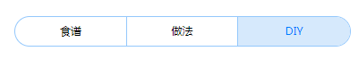

#### 1. 底部删除按钮
```html
<div class="btn-container">
	<div class="btn btn-large" @click="btnDelete">去连接网络</div>
</div>
```


#### 2. 头部的 `tab-bar`

```html
<div class="tab-bar">
	<div class="wrap">
		<ul class="tab-bar-container">
				<li class="tab-bar-item">食谱</li>
				<li class="tab-bar-item">做法</li>
			<li class="tab-bar-item active">DIY</li>
		</ul>
	</div>
</div>
```

```css
@import url(".../hi_home/static/css/btn/tab-bar.less");
```




---


#### 按钮颜色

> 默认颜色为浅蓝色

`class="btn btn-danger"`


`class="btn btn-primary"`


`class="btn btn-defaulut"`


---


#### 按钮特效

> btn 默认自带了这个样式

点击置灰 `class="btn btn-mask"`


---


### btn-small

