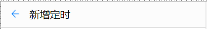
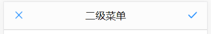
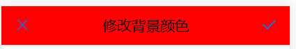
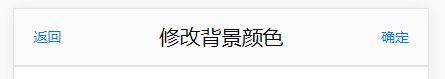
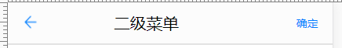

### `Header`

+ `title` : 头部文字内容
+ `bgc` : 头部背景颜色
+ `isSecondary` : 是否为二级子页面头部
+ `@leftClick` :  注册左边按钮的点击事件
+ `@rightClick` : 注册右边按钮的点击事件

---


#### 1. 一级子页面头部

```html
<Header
	:title="'新增定时'"></Header>
```



---


#### 2. 二级子页面头部

``` html
<Header
	:title="'二级菜单'"
	:isSecondary="true"></Header>
```



---


#### 3. 自定义背景颜色

```html
<Header
	:title="'修改背景颜色'"
	:bgc="'red'"
	:isSecondary="true"></Header>
```



---


#### 4. 自定义左右内容

```html
<Header
	:title="'修改背景颜色'"
	:isSecondary="true">

	<span slot="left">返回</span>
	<span slot="right">确定</span>
</Header>
```



> 可以用类名控制样式: 
>
> + back: 向左箭头
> + close: 打叉
> + open: 打钩

```html
<Header
	:title="'二级菜单'"
	:isSecondary="true">

	<span slot="left" class="back"></span>
	<span slot="right">确定</span>
</Header>
```



---


